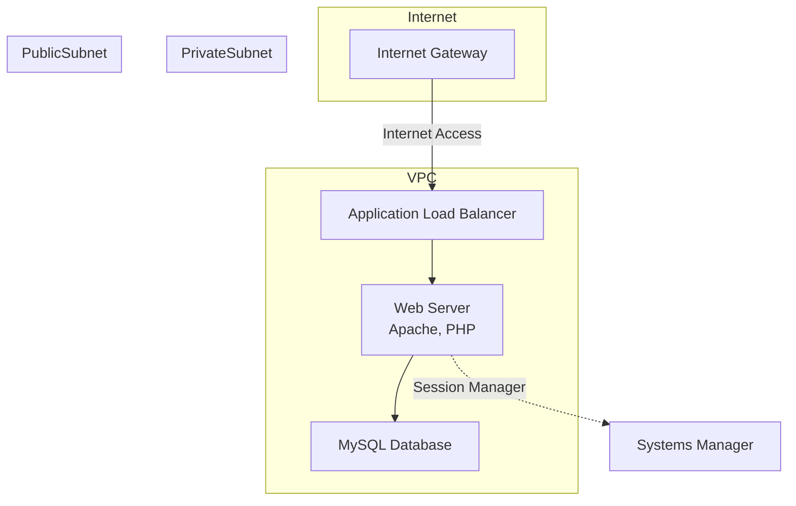

# 001 - EC2 x LAMP環境の構築

## 概要
AWS EC2上にセキュリティベストプラクティスに準拠したLAMP環境をTerraformで構築する研修課題です。  
Infrastructure as Code（IaC）を活用し、スケーラブルで保守性が高く、セキュアなWebアプリケーション基盤を構築します。

## アーキテクチャ図

## 技術要件

### 1. Infrastructure as Code（IaC）
- **Terraform**を使用してAWSリソースを管理
- バージョン管理されたインフラコード
- 環境ごと（dev/staging/prod）の設定分離
- リソースの依存関係を明確に定義

### 2. ネットワーク構成
- **VPC（Virtual Private Cloud）**による独立したネットワーク環境
- **Public Subnet**: Web層（ALB、Webサーバー）
- **Private Subnet**: データベース層（MySQL EC2）
- **Internet Gateway**: インターネット接続
- **NAT Gateway**: プライベートサブネットからのアウトバウンド通信

### 3. セキュリティ要件
#### 3.1 ネットワークセキュリティ
- **セキュリティグループ**による最小権限の原則
  - ALB: HTTP(80)、HTTPS(443)のみ許可
  - Web層: ALBからのトラフィックのみ許可
  - DB層: MySQL(3306)をWeb層からのみ許可
- **NACLs（Network Access Control Lists）**による多層防御
- **VPC Flow Logs**の有効化

#### 3.2 アクセス制御
- **IAMロール**による最小権限の原則
- **AWS Systems Manager Session Manager**を活用したセキュアなリモートアクセス
- **EC2インスタンスプロファイル**の適切な設定
- **MFA（多要素認証）**の実装検討

#### 3.3 暗号化
- **EBS Volume**の暗号化
- **データベース**の保存時暗号化
- **SSL/TLS証明書**（AWS Certificate Manager）による通信暗号化

#### 3.4 監視・ログ
- **CloudWatch**によるシステム監視
- **CloudTrail**による操作ログ記録
- **VPC Flow Logs**によるネットワーク監視
- **セキュリティアラート**の設定

### 4. アプリケーション構成
- **Linux（Amazon Linux 2）**
- **Apache HTTP Server**
- **MySQL 8.0**（EC2上に構築）
- **PHP 8.x**
- **Application Load Balancer**による負荷分散

### 5. 運用・保守
- **Auto Scaling Group**による自動スケーリング
- **EBS Snapshot**による定期バックアップ
- **CloudWatch Alarms**による監視とアラート
- **Systems Manager Patch Manager**による自動パッチ適用

## パフォーマンス要件

### 負荷テスト
- **k6**を使用した負荷テスト実施
- **専用テストインスタンス**からのテスト実行
- **目標値**:
  - 同時接続数: 100ユーザー
  - レスポンス時間: 平均500ms以下
  - エラー率: 1%以下
  - 可用性: 99.9%以上

## コスト最適化
- **リソースタグ**によるコスト追跡
- **開発環境**の自動停止・起動スケジュール
- **適切なインスタンスタイプ**の選定
- **Spot Instances**の活用検討（開発環境）

## 成果物
1. **Terraformコード**（各リソースの定義）
2. **セキュリティ設定**（セキュリティグループ、IAMポリシー）
3. **アプリケーション設定**（Apache、PHP、MySQL設定）
4. **負荷テストスクリプト**（k6）
5. **運用手順書**（デプロイ、監視、障害対応）
6. **セキュリティチェックリスト**
7. **アーキテクチャ設計書**（構成選択の理由と代替案の検討）

## 学習目標
- セキュリティファーストなインフラ設計
- Infrastructure as Codeの実践
- AWS Well-Architected Frameworkの理解
- 負荷テストとパフォーマンス最適化
- 運用監視とトラブルシューティング

## 前提条件
- AWSアカウントの準備
- Terraformのインストール（v1.0以上）
- AWS CLIの設定
- 適切なIAM権限の付与

## 実装手順（概要）
1. **環境準備**
   - Terraformのセットアップ
   - AWS認証情報の設定

2. **ネットワーク構築**
   - VPC、サブネット、ルートテーブルの作成
   - セキュリティグループの設定

3. **アプリケーション基盤**
   - EC2インスタンスの構築
   - ALBの設定
   - Auto Scalingの設定

4. **データベース構築**
   - MySQL EC2インスタンスの設定
   - データベースの初期化

5. **監視・ログ設定**
   - CloudWatch設定
   - アラート設定

6. **負荷テスト**
   - k6スクリプトの作成
   - パフォーマンステストの実行

7. **セキュリティ検証**
   - セキュリティチェックリストの確認
   - 脆弱性スキャンの実施

## アーキテクチャ設計の背景

### なぜこの構成を選択したか
1. **シンプルさと実用性のバランス**
   - 踏み台サーバーを排除し、Session Managerを活用
   - 管理対象リソースを最小化してコストと運用負荷を削減

2. **セキュリティとアクセシビリティの両立**
   - WebサーバーをPublic Subnetに配置してALBからの直接アクセスを可能に
   - データベースはPrivate Subnetで完全に分離

3. **モダンなアクセス管理**
   - SSH接続に依存せず、Session Managerによる監査可能なアクセス
   - IAMロールベースの権限管理
